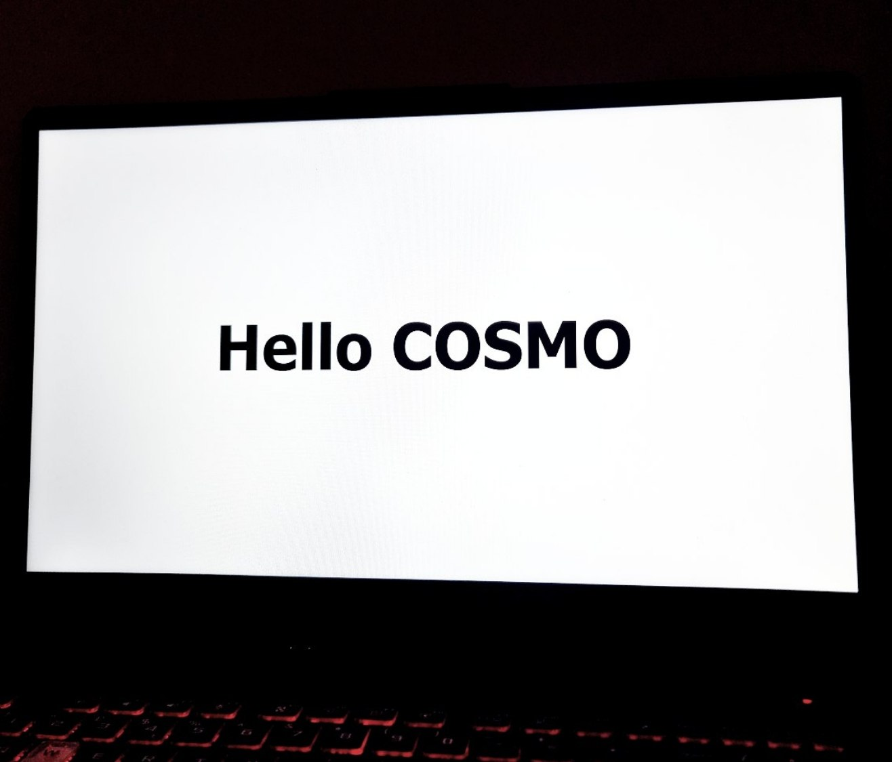
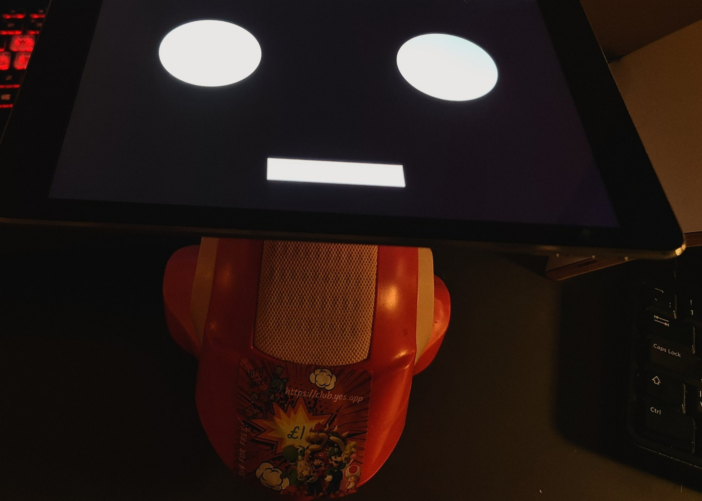
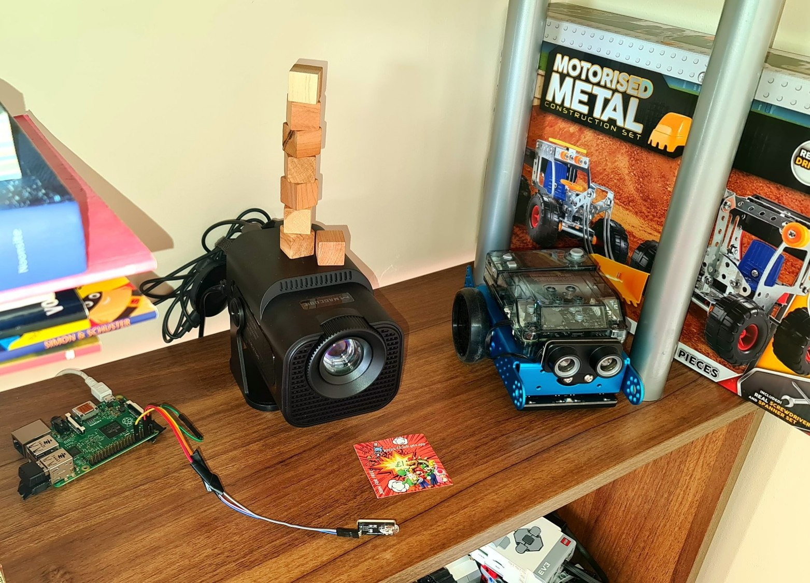

# COSMO ❤
COSMO Project Overview

The COSMO project began after my son asked me to build a **robot** for his granddad, who is disabled. In the UK alone, there are over 3 million people with similar conditions, yet the market lacks accessible and effective products to meet their needs. Seeing this gap, we started an open-source project to develop a small, user-friendly robot designed specifically to help my dad. Later, Astra appeared, than Luna and few month ago I wrote a book about COSMO, and the Astra and Luna books are both in progress.

### Support the project by purchasing my book [COSMO](https://cosmo.yes.app). All proceeds will be donated to charity and individuals in need, like my dad. It is an audio book — a captivating and original puzzle book inspired by my dad. It's unlike any other book you've listened before, blending mystery and emotion with a unique structure that keeps you guessing until the fascinating and unexpected ending.

Currently, I have integrated a next core services called Cosmo, Astra and Luna which combine several key technologies.
Start in the order described below this will gradually introduce you and your kid to the project. If any issues - contact me on [Discord Channel](https://discord.gg/dVgZ73tp6)

# Project Overview
1. COSMO face: rus on PC or old iPad or phone. No hardware or purchases required! Introduce your child to basic programming, including API calls, HTML, CSS, and JavaScript. It’s fun and interactive — COSMO’s face can smile, play tricks on your dog, or even make it think there’s a cat in the house! (check folder [cosmo/face/](cosmo/face/README.md)). 
2. COSMO listen: Learn how to use public APIs and interact with ChatGPT through code. Also it teach your child to basic phone automation and turns your phone into a powerful tool. Requires budget Android smartphone (£100 Moto G35, can be any Android) that runs Tasker and ChatGPT via API (check folder [cosmo/senses/listen/](cosmo/senses/listen/README.md)). It requires registration with OpenAI, the company behind ChatGPT, and a one-time payment of $5–$10 to obtain your personal ChatGPT API key, which will be used with COSMO. Also requires the Tasker app (available free for 7 days — contact me via [Discord Channel](https://discord.gg/dVgZ73tp6) if you need the link). Bonus: Real time STT (Speech-to-Text) via own GPU server using Whisper.cpp
3. COSMO speak: Make COSMO speaking. Hands-on tech fun for parents and kids: explore APIs, integrate systems, and safely work with wires. Contact me on [Discord Channel](https://discord.gg/dVgZ73tp6) if you need any help; (check folder [cosmo/senses/speak/](cosmo/senses/speak/README.md)). 
4. COSMO touch: A basic introduction to microcontrollers and how to program them in C++. It requires a Heltec V3 or ESP32-S3 (both around £10) and a few wires — no soldering needed. Contact me on [Discord Channel](https://discord.gg/dVgZ73tp6) if you’re unsure which to buy (check folder [cosmo/senses/touch/](cosmo/senses/touch/README.md)). 
5. ASTRA show: Discover fun bedtime automations with your child — like evening stories. It helps you save time while letting you select valuable educational content and schedule when it’s streamed to your kid. A basic introduction to Linux, Raspberry Pi, Python, and IR sensors. Requires: Raspberry Pi and Chromecast - connected to an old TV or £30 Projector via HDMI -> for streaming content (check folder [astra/](astra/README.md))
6. LUNA car. It teaches C++, HTML, JavaScript, CSS, microcontrollers, motor control, soldering, and how to assemble the entire project. This is our most complex project, requiring a bit of soldering and construction skills for both you and your child, check folder [luna/](luna/README.md)) It uses an ESP8266, [4WD Kit with 4 motors and wheels for £11](https://www.aliexpress.com/item/1005009381370680.html), [L298N for £2](https://www.aliexpress.com/item/1005009009861868.html) motor driver, two Li-ion 18650 batteries and plenty of wires. Watch the detailed assembly video on [YouTube for guidance](https://www.youtube.com/watch?v=dcSIBYogxzA). Contact me on [Discord Channel](https://discord.gg/dVgZ73tp6) if you’re unsure which to buy.

COSMO

Here is LUNA

Below is ASTRA

# Honorable mentions
 * Thanks to God that gives...
 * To my father and my son: without them, this project would not exist
 * ApenAI and [ChatGPT](https://chatgpt.com)
 * Eben Upton from Cambridge for inventing [Raspberry Pi](https://www.raspberrypi.com/) in 2012 
 * [Espressif](https://www.espressif.com/) Systems for ESP32 and ESP8266
 * [Heltec Automation](https://heltec.org/) 
 * Mattel for Hot wheels Die-Cast Cars 😉❤❤❤ 
 * João Dias [Tasker Android APP](https://play.google.com/store/apps/details?id=net.dinglisch.android.taskerm) and his [homepage](https://tasker.joaoapps.com)
 * Anton Hvornum Aka Torxed https://github.com/Torxed/chromecast
 * [Perth Linux User Group](http://plug.org.au/)'s [talk from 2016](https://docs.google.com/presentation/d/1X1BdFunVnLkF7L0BgevH2zzkcSe0_gtdTJ_pMdEuakQ/htmlpresent)
 * [pychromecast](https://github.com/home-assistant-libs/pychromecast) Which had a lot of `URN`'s that could be re-used
 * [casttube](https://github.com/ur1katz/casttube) Which had all the YouTube Web-API's to manage a YouTube lounge
 * Google for inventing [Chromecast](https://en.wikipedia.org/wiki/Chromecast) in 2013 and making the [ProtoBuf](https://developers.google.com/protocol-buffers/docs/encoding) protocol very open and easy to deconstruct; Google Drive and [Android](https://www.android.com) 
 * [Home Assistant](https://www.home-assistant.io/) for integrating Alexa, ChatGPT, Piper, Whisper, and multiple sensors
 * Jong Wook Kim and Open AI for [Whisper](https://openai.com/index/whisper/) 
 * Georgi Gerganov for [Whisper C++](https://github.com/ggml-org/whisper.cpp)
 * Michael Jae-Yoon Chung and his minimalist tablet [tablet-robot-face](https://github.com/mjyc/tablet-robot-face) eyes
 * [Ably](https://ably.com) for SSE (Server-Sent Events) – plus 6 million free COSMO smiles every month! 😄
 * Thanks to [Apple](https://www.apple.com/), my old iPad mini has become a brand-new COSMO face
 * Thanks to [Pixabay](https://pixabay.com), [Oleg Fedak](https://pixabay.com/users/30064790/), and many more creators for sounds
 * Big thanks to [Tim Berners-Lee](https://en.wikipedia.org/wiki/Tim_Berners-Lee) for developing HTML in 1991
 * Microsoft for [VS Code](https://code.visualstudio.com/)
 * Guido van Rossum who invented [Python](https://www.python.org/) in 1990
 * Amazon [Alexa](https://www.amazon.com/b?node=9818047011&ref_=MARS_NAVSTRIPE_desktop_bar_Alexa%2B_shopall) who offers £25 speakers with an excellent TTS capabilities
 * Simone Chemelli for Python [library](https://github.com/chemelli74/aioamazondevices) to control Amazon devices
 * Marcelo Trylesinski for [Uvicorn](https://github.com/Kludex/uvicorn) server on Python

## Support the project by purchasing my book [COSMO](https://cosmo.yes.app). All proceeds will be donated to charity and individuals in need, like my dad.
