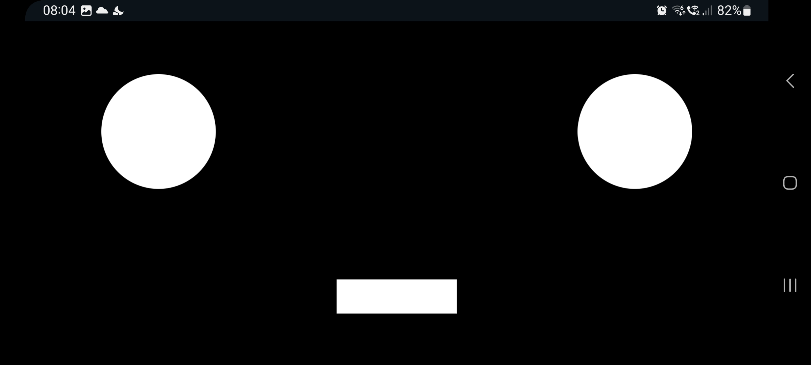
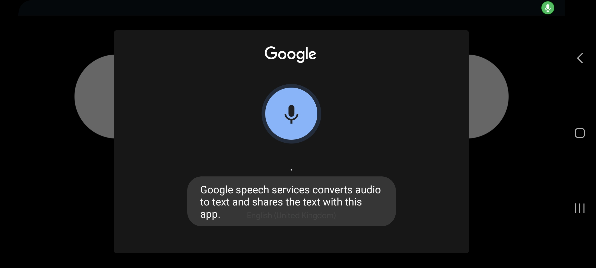
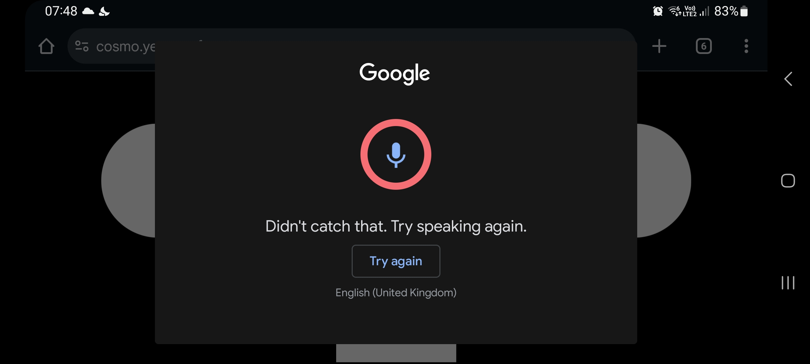

# COSMO ❤
COSMO Face

While looking at my old iPad sitting in the drawer, I thought, this could be a COSMO face.
I turned to my son and asked, “Would you want COSMO to have its own face?”...

### Recent studies show that people often prefer a digital face over a physical one. A screen-based face is easy to build, customize, and update. I can create any combination of eyes, smiles, gestures, and templates — and even let the face grow and age over time alongside the robot. Plus, I can display technical information, like debug data, right on the screen.

And so, my old iPad mini became the perfect candidate for COSMO’s new face.

#### I’m currently using two separate devices for COSMO (you can use one, but read below)
    * One is an Android phone running COSMO, which acts as the “brain” and handles voice processing (Samsung or Google: TTS/STT, Tasker, ChatGPT API, web server). Its screen stays off, but it can still receive HTTP GET requests from ASTRA
    * The other is an old iPad Mini running ASTRA Face, which serves as the UI and display

For now, keeping the devices separate during the prototype phase is much more convenient. In this setup, the COSMO phone stays locked with the screen off, handling logic, voice processing, and commands, while ASTRA (on the iPad) stays always on, providing the interface and activating voice interactions (ChatGPT responses on tap) back to COSMO. Essentially, COSMO has the brain, ears, and voice, while ASTRA provides the face and visual display — together, they make a great team.

### Support the project by purchasing my book [COSMO](https://cosmo.yes.app) All proceeds will be donated to charity and individuals in need, like my dad. It is an audio book — a captivating and original puzzle book inspired by my dad. It's unlike any other book you've listened before, blending mystery and emotion with a unique structure that keeps you guessing until the fascinating and unexpected ending.

# Usage: open in your PC (in full screen 'F11') or old phone (turn phone horizontally) or on tablet
1. [https://cosmo.yes.app/](http://cosmo.yes.app/face) works from Chrome PC and Android
2. [http://astra.yes.app/](http://astra.yes.app/) or [http://13.60.242.202/](http://13.60.242.202/) works from Firefox PC
2. Import [COSMO Listen Profile](tasker/COSMO_listen.prf.txt) into your Tasker and link with [COSMO Task](tasker/COSMO_task.prf.txt)

This is how it looks on a single Android device: Google Assistant opens a large overlay window on top of Cosmo’s face 👾 It works for testing, but I recommend using two separate devices — one for the face and another for speech recognition, as described above. Everything works smoothly this way — I don’t need to unlock my phone, reconnect anything, or reinstall the app. The setup is simple, stable, and very reliable:

# Send 'smile' command
    curl -X POST https://rest.ably.io/channels/cosmo_face/messages -u "CClXdw.Z3P7Fw:G1W_WXLZYUpqqnjvplbv_GDmUJ3TB4lk1bs54DblqpE" -H "Content-Type: application/json" --data '{ "name":"cURL","data": "smile" }'

# Send 'blink' command
    curl -X POST https://rest.ably.io/channels/cosmo_face/messages -u "CClXdw.Z3P7Fw:G1W_WXLZYUpqqnjvplbv_GDmUJ3TB4lk1bs54DblqpE" -H "Content-Type: application/json" --data '{ "name":"cURL","data": "blink" }'

# Emotions
    blink|smile|sad|angry|focused|confused|startBlinking|stopBlinking|think|cat|forest

# Emotions
    Pressing on COSMO face should activate "ChatGPT" in phone tasker

# Known Issues:
 When COSMO Face is running from over HTTPS. Tapping on the face tries to send a request to http://192.168.1.109:1888/ask4, which is HTTP. Firefox, Safari browsers block this as “mixed active content”, resulting in the error:
Workaround: Use "face" on Chrome (PC) or Android and allow permission 

or run COSMO Face locally via HTTP (e.g., just openeing index.html) so that both the page and the request use the same protocol, avoiding mixed content restrictions

# TODO:
 * Use my API key, and both your COSMO and mine will smile at the same time 😄. Feel free to try it out for testing!
 * Implement more mouth emotions to see the magic
 * Wake-on-key-word for COSMO

# Honorable mentions
 * Thanks to God that gives...
 * To my father and my son: without them, this project would not exist ❤❤
 * Michael Jae-Yoon Chung and his minimalist tablet [tablet-robot-face](https://github.com/mjyc/tablet-robot-face) eyes
 * [Ably](https://ably.com) for SSE (Server-Sent Events) – plus 6 million free COSMO smiles every month! 😄
 * Thanks to [Apple](https://www.apple.com/), my old iPad mini has become a brand-new COSMO face
 * Thanks to [Pixabay](https://pixabay.com), [Oleg Fedak](https://pixabay.com/users/30064790/), and many more creators for sounds
 * Thanks AWS for hosting and free [EC2 instance](https://aws.amazon.com)
 * Big thanks to [Tim Berners-Lee](https://en.wikipedia.org/wiki/Tim_Berners-Lee) for developing HTML in 1991
 * Microsoft for [VS Code](https://code.visualstudio.com/)

## Support the project by purchasing my book [COSMO](https://cosmo.yes.app). All proceeds will be donated to charity and individuals in need, like my dad.