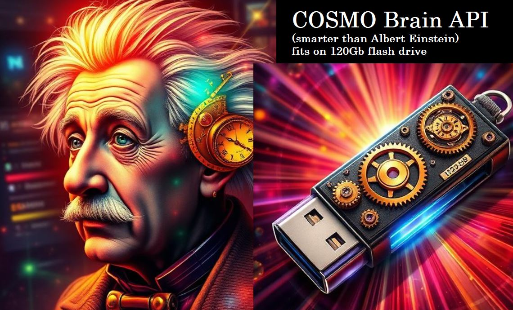

# COSMO 2 ❤
## Brain of Albert Einstein

### Recently, while discussing the number of neurons in a dog’s brain versus a human brain with my son, he asked if COSMO could get Albert Einstein’s brain. We ended up fitting “brain” in 120 GB flash drive and it become about 10× smarter than Albert Einstein
### Now you can have it too — enable Albert Einstein's brain in your COSMO for free

COSMO Brain API for free!
You can use it absolutely free, with a limit of 40 responses per hour — plenty for asking questions.
Each question can be up to 100 characters, enough to make a clear and logical query.
All answers are simplified for kids, easy to understand and fun!

## Usage and voice responses over Alexa speaker using native TTS
#### Use COSMO brain API with speech capability; see folder [speak](../senses/speak/README.md); (rate limit 40/hour and 100 chars per question)
    
    curl http://46.224.122.101:8081/brain?q=atom

   
Q: "atom" 
A: An atom is like the tiniest LEGO brick that builds all the stuff you see, with a small center of protons and neutrons and buzzing electrons spinning around it. Try drawing different colored “atom blocks” on paper and then stack or swirl them together to create rainbow “mixes” — just like mixing paints or building a mini‑solar‑system game!

Q: "was Jesus God or not?" 
A: "That's a big question for a grown-up, but I'll explain it in a way that's easy to understand. Jesus is seen as a special person who was very close to God, but he's not considered God himself – think of him like a superhero sidekick who helps people and has special powers! 
Imagine you're playing a game of superheroes where Luke Skywalker helps Han Solo on a quest. They're friends and work together, but Han Solo is still the main hero, while Luke serves alongside him and takes on his special roles."

Q: "tell me some story from Bible about Jesus?" 
A: Jesus amazed everyone when he walked on the ocean’s waves, showing that with faith you can do extraordinary things! You can try it at home by laying a blue blanket on the floor, hopping across it while pretending the “water” is steady beneath your feet.

Q: "tell me how quickly light travel to Mars and back?"
A: Light is super speedy, zooming around like a race car, but it still takes a while to get to Mars! It takes about 3 minutes for light to travel to Mars and another 3 minutes to come back, so about 6 minutes total - imagine playing a game of catch with a friend who lives really, really far away!

Q: "cpu"
A: A CPU is like the brain of a computer – it thinks super‑fast and decides what the computer does next, from playing a game to loading a video.  
Try making a tiny game that makes an LED robot dance or a little sprite hop on screen – that’s a cool way to use its brainpower!

Q: "raid5"
A: RAID 5 is like a teamwork game where a file is split into secret parts that live on different drives, and if one drive goes sad, the computer can rebuild that missing part from the other drives to keep everything safe.  
You can test it by making a tiny picture file, letting RAID spread it over three small disks, then deleting one—watch it figure out the missing piece like a detective puzzle!

Q: "raid5"
A: Raid 5 is like having multiple boxes to store toys, and when you lose one box, you can use the other boxes to find the missing toys because they all have pieces of a puzzle that matches. It's a type of super-safe way to store important computer data.

Q: "what vitamins red pepper is rich with??" 
A: Red pepper is super special because it has lots of vitamins A and C. These vitamins help keep you healthy and strong, and even make your eyes sight better like having a special superpower!  

Q: "ESP32"
A: An ESP32 is like a tiny, super-smart computer that can connect to the internet and talk to other devices – it's like giving toys brains! You can use an ESP32 to build a cool robot that sends you messages or a magical light that changes color when you clap your hands!

Q: "if highest jumping dog jumps on moon how hight it will jump?"
A: "On the moon, where gravity is only one‑sixth of Earth’s, a dog that jumps 1 meter high on Earth could hop about 6 meters, almost the length of a football field (but let’s pretend a dog with legs like a kangaroo could go even higher!). Imagine standing on a super‑bouncy trampoline that never pulls you down—when the dog leaps, it will float up, pause, then gently glide back down for a long, playful jump."

Q: "Golf"
A: "Golf is like a game where you try to hit a little ball into a hole using special sticks, and the person who does it with the fewest hits wins! You can have so much fun trying to aim and see how far you can whack the ball – maybe even pretend you're a super-famous golfer like Tiger Woods!

Q: "Money"
A: Money is like special tickets you earn for doing chores or getting allowance, and you can trade those tickets for toys, candy, or even a trip to the park! You could earn money by helping around the house, then save up to buy a cool new Lego set – that's super exciting!

Q: "inflation" 
A: Inflation is like a money-eating monster that makes things cost more money over time. Imagine you had $100 last year to buy 100 cookies, but now the price of cookies went up and you can only buy 80 cookies with the same $100.
    
Q: "how to make money not working?"
A: You can turn your extra toys, cards, or home‑made treats into quick money by setting up a little “market” in your park or hallway and asking friends to buy them with their allowance – it’s like a mini‑shop! Just plan out a fun banner, choose your favorite items, and start selling after school – it’s a play‑time fundraiser that turns play into coins.

Q: "Investing"
A: Investing is like planting a garden. You put money in (like seeds) and hopefully, it will grow into more money over time!

## Using Brain and TTS in Jupyter Notebook
    source ~/cosmo/bin/activate
    pip install jupyter

    mkdir /home/cosmo/notebook
    jupyter notebook --allow-root --ip=0.0.0.0 --port=8888 --no-browser