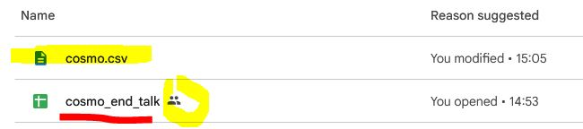
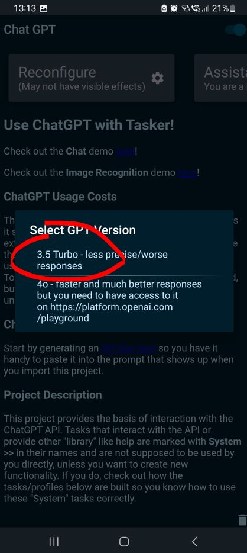
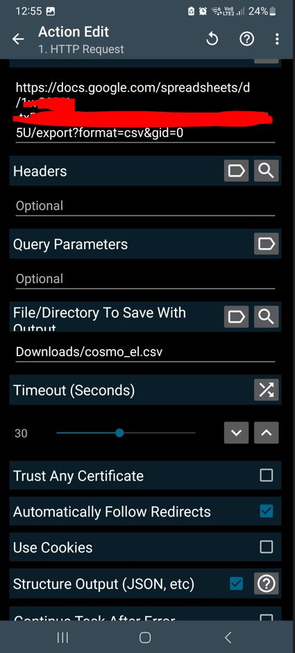
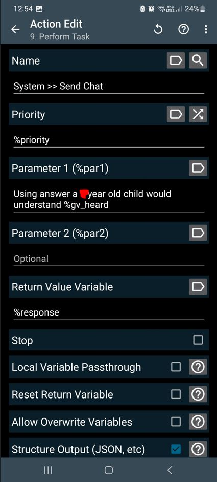
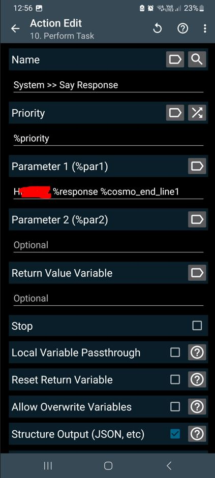
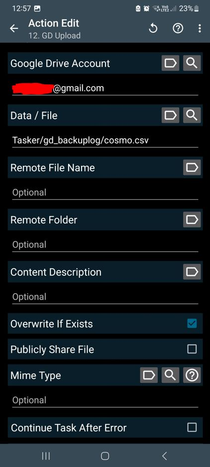

# COSMO 2 ❤
COSMO 2 Project (COSMO, living in my son’s phone) 😉❤❤❤

# What you get 
    Fewer questions from your son that you can’t answer
    A smarter son, empowered with a coolest phone
    
# Usage
    shake phone and magic happends... 😉❤❤❤ 

# Usage 2 (replace IP with your own)
    curl -X GET http://192.168.1.109:1888/ask4

# What you need
    Android phone
    Tasker app
    ChatGPT API key

How to: 
1. The cosmo_end_talk.xls file needs to be in your Google Drive folder, and you can update with your own short personality prefixes that will be added at 'end talk'. It need to be shared with link as on picture below.
2. The cosmo.csv file needs to be in your GoogleDrive folder so it can store and be updated with logs of questions, answers, and timestamps.

3. If you need more detailed steps, go through the images in the [config_screenshots](senses/listen/config_screenshots) folder one by one.

### Support the project by purchasing my book [COSMO](https://cosmo.yes.app). All proceeds will be donated to charity and individuals in need, like my dad. It is an audio book — a captivating and original puzzle book inspired by my dad. It's unlike any other book you've listened before, blending mystery and emotion with a unique structure that keeps you guessing until the fascinating and unexpected ending.

## Support the project by purchasing my book [COSMO](https://cosmo.yes.app). All proceeds will be donated to charity and individuals in need, like my dad.