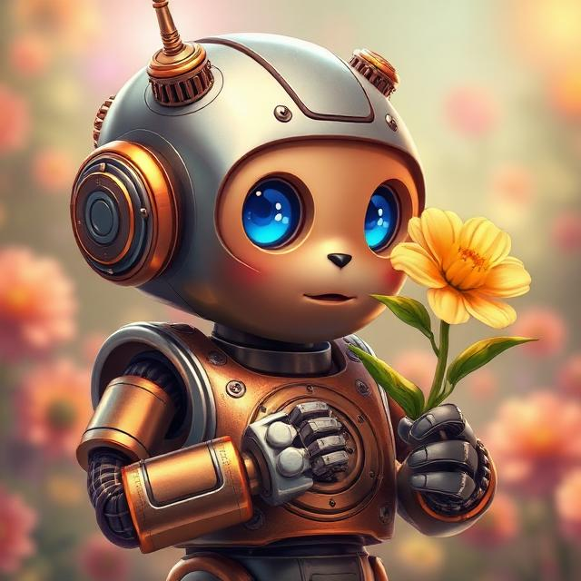

# COSMO ❤
## COSMO electronic nose

## Dogs can smell far better than humans, and watching my dog made me wonder why, with all the sensors we have, no one has built a real electronic nose yet.

### When you eat clementines or oranges, COSMO smells them and reacts by sniffing.

# Make it working
  * Flash ESP-32 with smell.cpp
  * Get CCS811 sensor for £5
  * Eat orange near COSMO

# Send 'smell' command
   curl -X POST https://rest.ably.io/channels/cosmo_face/messages -u "CClXdw.Z3P7Fw:G1W_WXLZYUpqqnjvplbv_GDmUJ3TB4lk1bs54DblqpE" -H "Content-Type: application/json" --data '{ "name":"cURL","data": "smell" }'

# Send 'cough' command
   curl -X POST https://rest.ably.io/channels/cosmo_face/messages -u "CClXdw.Z3P7Fw:G1W_WXLZYUpqqnjvplbv_GDmUJ3TB4lk1bs54DblqpE" -H "Content-Type: application/json" --data '{ "name":"cURL","data": "cough" }'

# Honorable mentions
 * Thanks to God that gives...
 * To my father and my son: without them, this project would not exist ❤❤
 * [Espressif](https://en.wikipedia.org/wiki/ESP32) for inventing ESP-32 

### Support the project by purchasing my book [COSMO](https://cosmo.yes.app). All proceeds will be donated to charity and individuals in need, like my dad. It is an audio book — a captivating and original puzzle book inspired by my dad. It's unlike any other book you've listened before, blending mystery and emotion with a unique structure that keeps you guessing until the fascinating and unexpected ending.

## Support the project by purchasing my book [COSMO](https://cosmo.yes.app). All proceeds will be donated to charity and individuals in need, like my dad.