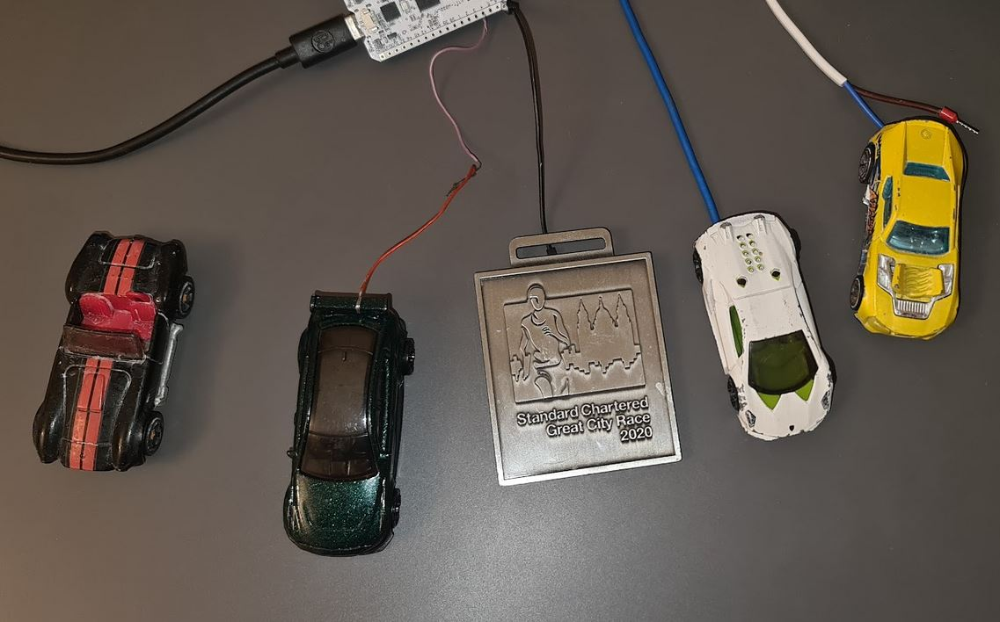

# COSMO Senses ❤

## Recently, my dog asked to be stroked, and my son and I thought — why not add something similar to COSMO? 

### I was looking for such sensors, but found that many available options didn’t fit my needs. This led me to the idea of building my own sensor. I chose the ESP32 for the project (I used the ESP32 Heltec V3, though I recommend the ESP32-S3 for future). By attaching a few of my son’s metal toy cars, we were able to activate ChatGPT in COSMO whenever the car was touched. You can extend COSMO’s senses by connecting an ESP32 to any conductive object — metal: Hot Wheels cars, coins, or metal create new touch inputs. 

# What you get
    Fancy Hot Wheels cars powered by ChatGPT 😉❤❤

# Usage
    Touch Hot Wheels car and magic happends... 😉❤❤❤

# What you need
    ESP32
    Few Hot Wheels cars 😉

Install PlatformIO in VS Code:

1. Open VS Code.
2. Click the Extensions icon on the left sidebar (or press Ctrl+Shift+X).
3. In the search box, type PlatformIO IDE.
4. Look for the official PlatformIO IDE by PlatformIO.
5. Click Install.
6. Modify config.h.template setting your WIFI and COSMO IP and move it to config.h
7. Build and Upload and Monitor

Below is an example how to [Build and Upload and Monitor in PlatformIO](https://www.youtube.com/watch?v=l3WudC4WBDo)

# Dependencies
    ESP32 
    COSMO

TODO: 
1. Add the remaining five senses and integrate them with COSMO 
2. Extend additional sensors such as a human presence sensor, light sensor, temperature sensor and more

### Support the project by purchasing my book [COSMO](https://cosmo.yes.app). All proceeds will be donated to charity and individuals in need, like my dad. It is an audio book — a captivating and original puzzle book inspired by my dad. It's unlike any other book you've listened before, blending mystery and emotion with a unique structure that keeps you guessing until the fascinating and unexpected ending.

## Support the project by purchasing my book [COSMO](https://cosmo.yes.app). All proceeds will be donated to charity and individuals in need, like my dad.