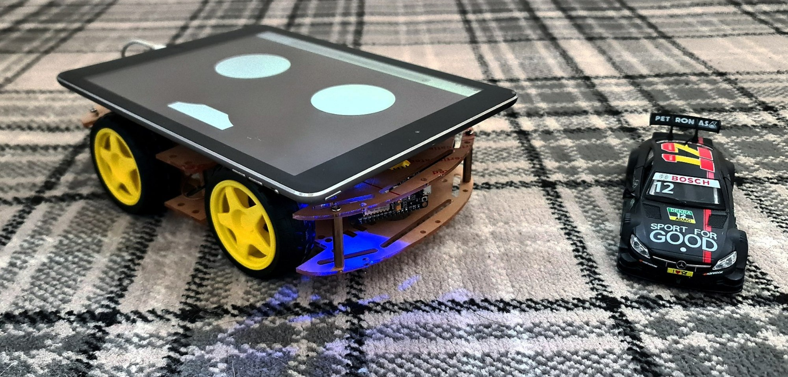

# LUNA ❤

## While boys often play with cars today, tomorrow they’ll be exploring the world of robots. Studies show that building and controlling robots with microcontrollers and programming not only sparks creativity but also strengthens spatial and problem-solving skills.

## LUNA Project Overview 😉❤❤❤ 

LUNA 4WD car. It teaches C++, HTML, JavaScript, CSS, microcontrollers, motor control, soldering, and how to assemble the entire project. This is our most complex project, requiring a bit of soldering and construction skills for both you and your child. It uses an ESP8266, [4WD Kit with 4 motors and wheels for £11](https://www.aliexpress.com/item/1005009381370680.html), [L298N for £2](https://www.aliexpress.com/item/1005009009861868.html) motor driver, two Li-ion 18650 batteries and plenty of wires. Watch the detailed assembly video on [YouTube for guidance](https://www.youtube.com/watch?v=dcSIBYogxzA). Contact me on [Discord Channel](https://discord.gg/dVgZ73tp6) if you’re unsure which to buy.

Here is LUNA

# Honorable mentions
 * Thanks to God that gives...
 * To my father and my son: without them, this project would not exist
 * ApenAI and [ChatGPT](https://chatgpt.com)
 * [Espressif](https://www.espressif.com/) Systems for ESP32 and ESP8266
 * Mattel for Hot wheels Die-Cast Cars 😉❤❤❤

## Support the project by purchasing my book [COSMO](https://cosmo.yes.app). All proceeds will be donated to charity and individuals in need, like my dad.
