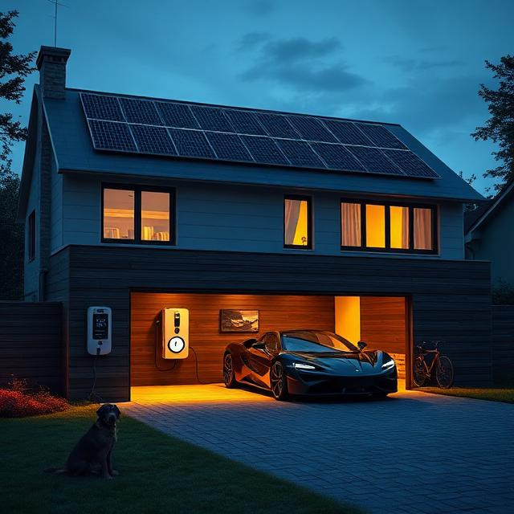
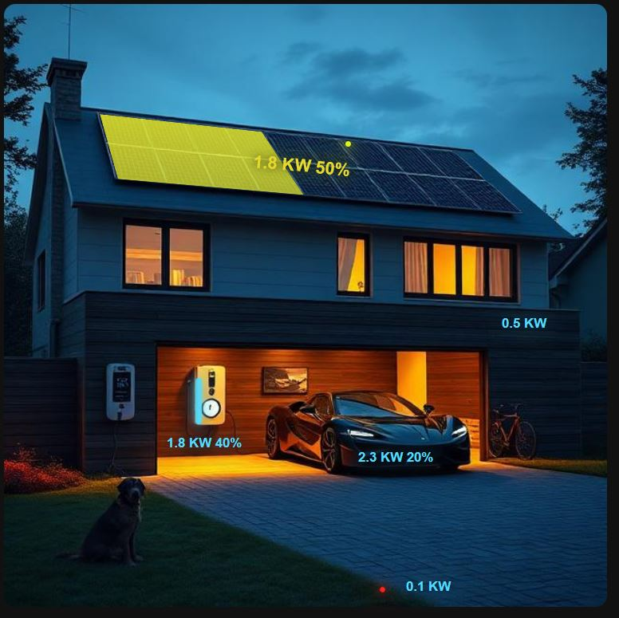
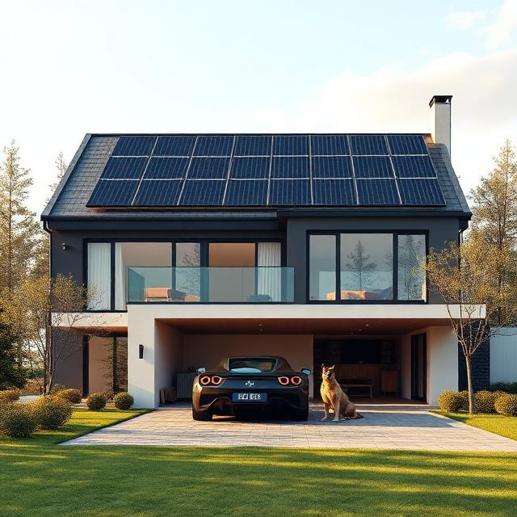
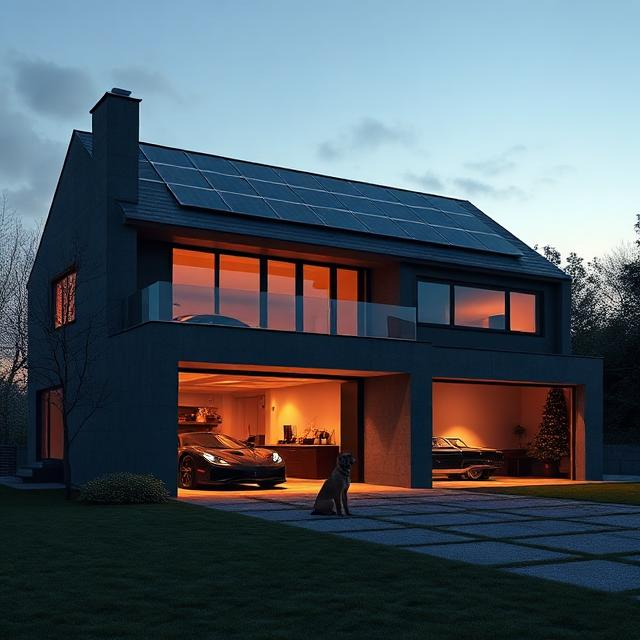
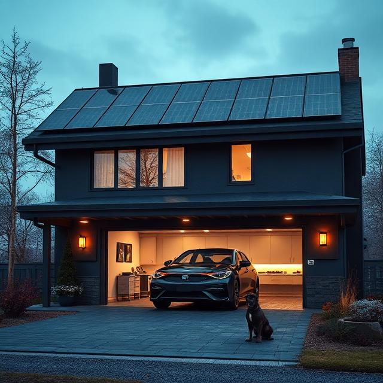

# NOVA futuristic off-grid house ❤

NOVA is a futuristic off-grid AI intelligence system that transforms a house into a living, adaptive environment — one that doesn’t just support life, but actively shapes it. Designed as the central cognitive core of COSMO’s autonomous living ecosystem, it functions as an artificial intelligence layer embedded into the home itself, coordinating energy, comfort, security, and experience through continuous learning and predictive decision-making.

You can customize your home and make it truly your own digital world. Add your house, name it, and shape it to match your lifestyle. Replace or remove elements freely—swap a car for a bicycle charger, or even choose a cat instead of a dog. Every part of the environment is flexible and personal.

You can also redesign the layout and visual style however you want, creating a space that reflects your identity. The system supports dynamic environments with day and night modes, as well as real-world weather effects like rain and snow.

Many more options are available—you can also add your own custom elements, colors, house setups, or configurations to make it truly personal and unique:

At its foundation, NOVA governs the home’s entire energy architecture. It continuously monitors solar generation, battery storage, and grid interaction, using AI-driven forecasting to predict demand and optimize distribution in real time. It decides whether energy should be stored, consumed, or exported, treating every watt as part of a dynamic, intelligent ecosystem rather than a static resource.

But NOVA goes far beyond energy management — it acts as a living home intelligence.

Inside the house, it orchestrates comfort systems such as air conditioning, heating, and ventilation. Through AI-based behavior modeling, it learns occupancy patterns, preferences, and environmental conditions, automatically adjusting climate control to maintain optimal comfort without manual input.

It also manages atmosphere and experience. Entertainment systems, home cinema environments, and multi-room music are unified into adaptive, AI-generated scenes that respond to presence, mood inference, time of day, and energy availability. The home becomes immersive and responsive, shaping experiences rather than simply delivering them.

For land and exterior systems, NOVA applies AI optimization to irrigation and environmental care, analyzing weather predictions, soil conditions, and seasonal patterns to minimize waste and maximize efficiency. At the same time, it operates a fully integrated perimeter security intelligence system, using sensor fusion, anomaly detection, lighting control, and surveillance analysis to maintain continuous protection.

Mobility is seamlessly integrated through intelligent EV charging management, where AI allocates power based on solar production forecasts, household demand, and user behavior patterns — ensuring readiness while preserving system stability.

Lighting, climate, security, and energy are no longer isolated systems. Under NOVA, they become interconnected AI agents within a unified home intelligence network, continuously communicating and self-adjusting to maintain balance between efficiency, comfort, and safety.

Ultimately, NOVA turns COSMO’s home into an intelligent, self-evolving environment — an off-grid living system powered by artificial intelligence. It learns from the past, predicts the future, and adapts in real time, creating a home that doesn’t just respond to life, but actively thinks ahead of it.

# send an open API command and you will see magic
    open index.html

    curl -X POST https://rest.ably.io/channels/nova/messages -u "CClXdw.Z3P7Fw:G1W_WXLZYUpqqnjvplbv_GDmUJ3TB4lk1bs54DblqpE" -H "Content-Type: application/json" --data '{ "name":"cURL", "data": { "solar_pct": "100", "solar":"7248", "car_pct": "80", "car":"2300", "battery_pct": "50", "battery": "6894", "house": "350", "grid": "100"}  }'

# OpenEVSE only
    1. mqtt
    mosquitto_sub -h localhost -t "#" -v -u emonpi -P emonpi -t "#" -v

    2. /usr/local/bin/uvicorn car:app --host 0.0.0.0 --port 8000  # web API energy export receiver -> writes to mqtt
    2.1. http://192.168.1.245:8000/e=800 Export 1500+

    source torch-env/bin/activate
    pip install paho-mqtt
    cd /mnt/c/Users/asus/git/cosmo/nova && jupyter-notebook --no-browser --ip=0.0.0.0 --port=8888 2>&1 &
    
    3. streamer.py # stream mqtt to UI
    