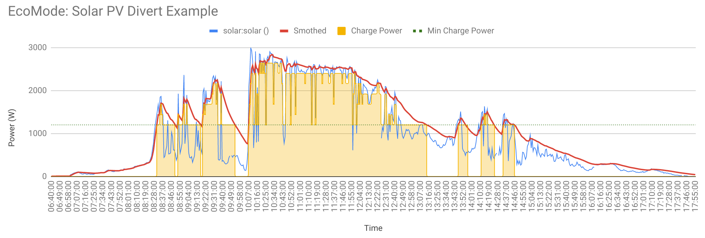

# NOVA ❤
## Solar production exporter

## Charge Your EV with Excess of Solar

Automatically charge your electric vehicle using surplus of solar energy.

As soon as your ESP32 solar monitor detects excess solar generation, the available surplus is published via MQTT and can be used to adjust your EV charging power in real time. This allows your EV charger to match the charging power to your available solar production, maximizing self-consumption and reducing energy imported from the grid.

Prerequisites

Before getting started, you will need:

* An ESP32 running the solar monitoring firmware.
* An MQTT broker (such as Mosquitto) running on your local network, typically on a Raspberry Pi.
* Adjust and rename config_template.h to config.h
* The MQTT broker must be accessible from both the ESP32 and your OpenEVSE (or other compatible EV charger).
* An open-source EV charger, such as OpenEVSE, or another charger capable of subscribing to an MQTT topic and adjusting the charging current accordingly.
* Configure [MQTT_TOPIC "cosmo"] in [config_template.h] for OpenEVSE
* Configure OpenEVSE for [Solar PV Divert](https://docs.openenergymonitor.org/emonevse/setup.html)
* ESP-32 S3 flashed with solar.cpp and wired as per solar_pinout.jpg
* You will need to install the CT clamp around the output cable of your solar inverter. Ensure the clamp is placed around only one conductor (live or neutral), not the entire cable, so it can accurately measure the current flowing from the inverter.

Once configured, the ESP32 publishes the available solar power to an MQTT topic, and the EV charger reads that topic to automatically adjust charging based on the available excess solar energy.

# Make it working
  * Flash ESP-32 with solar.cpp £15
  * SCT-013-030 sensor for £7
  * 2x 10K resistors £0.01
  * 10uf capacitor £0.01

# Debug and monitor mqtt topic
    mosquitto_sub -h localhost -t "#" -v -u emonpi -P emonpi -t "#" -v
    
      cosmo 672
      cosmo 666
      cosmo 673
      cosmo 1777
      cosmo 1772
      cosmo 2283
      cosmo 2274
      cosmo 2271
      cosmo 2274
      cosmo 566
      cosmo 109
      cosmo 108
      cosmo 108
      cosmo 0
      cosmo 0
      cosmo 2282
      cosmo 2269
      cosmo 2279
      cosmo 0
      cosmo 0
      cosmo 106
      cosmo 111
      cosmo 227
      cosmo 667
      cosmo 1772
      cosmo 1140
      cosmo 2272
      cosmo 499
      cosmo 109
      cosmo 0
      cosmo 0
      cosmo 0
      cosmo 0
      cosmo 18
      cosmo 0
      cosmo 0
      cosmo 0

# Known Limitations
* The current implementation measures the magnitude of the current only. It cannot determine the direction of power flow (importing from or exporting to the grid).
* Because of this limitation, placing the CT clamp on the house mains supply is not recommended, as the system cannot distinguish between electricity being consumed from the grid and surplus solar energy being exported.
* For this reason, the CT clamp should be installed on the output cable of the solar inverter. This measures the inverter's total power production rather than the actual exported surplus.
* The system therefore does not account for the house's own electricity consumption. To avoid importing power from the grid when EV charging starts, you can configure a safety margin (for example, 300 W) and only enable EV charging when the measured solar production exceeds this threshold. This helps ensure that a reasonable amount of surplus solar energy is available before charging begins.
* A future improvement is planned to add AC voltage measurement (for example, using a ZMPT101B voltage sensor module). By measuring both voltage and current and calculating real power, the system will be able to determine the direction of power flow and accurately distinguish between grid import and export.

# Honorable mentions
 * Thanks to God that gives...
 * To my father and my son: without them, this project would not exist ❤❤
 * [Espressif](https://en.wikipedia.org/wiki/ESP32) for inventing ESP-32 
 * [OpenEVSE](https://github.com/openevse) for open source EV charger

### Support the project by purchasing my book [COSMO](https://cosmo.yes.app). All proceeds will be donated to charity and individuals in need, like my dad. It is an audio book — a captivating and original puzzle book inspired by my dad. It's unlike any other book you've listened before, blending mystery and emotion with a unique structure that keeps you guessing until the fascinating and unexpected ending.

## Support the project by purchasing my book [COSMO](https://cosmo.yes.app). All proceeds will be donated to charity and individuals in need, like my dad.